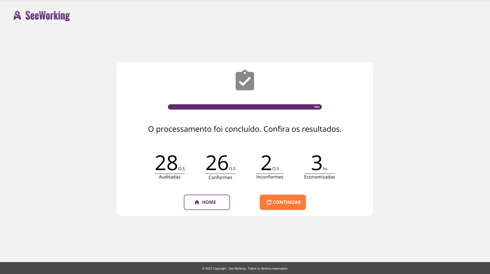

# Processo seletivo da Juridics 2022.1

Bem-vindo ao exame técnico para o processo seletivo da Juridics.
Em primeiro lugar, agradecemos pelo seu interesse e sua disponibilidade em realizar mais esta etapa do processo seletivo.
Consideramos fundamental esta etapa do processo, pois permitirá que tanto você quanto a Juridics se conhecam um pouco melhor.

Desde já, salientamos que este exame irá medir o seu nível de "se virômetro", ou seja, o quanto é capaz de encontrar
soluções no dia a dia. Portanto, você está livre para pesquisar na Internet e até mesmo copiar códigos dos outros.
Porém, apresente um código final legível, entendível e organizado, pois isso será usado como critério de avaliação. Se tiver conhecimentos sobre clean code, utilize na sua solução.

Para realizar este exame, siga os seguintes procedimentos:
- Clone este repositório;
- Implemente cada questão na sua respectiva pasta;
- Faça um zip da pasta de repositório e envie para o email charles@juridics.com.

### Questão 1) Desenvolva em *html e css* a tela de exemplo
Crie a tela abaixo utilizando somente HTML e CSS. Faça o mais parecido possível com o desenho.


### Questão 2) Desenvolva uma função *em javascript* para retornar a sequência de Fibonacci
A sequência de Fibonacci é composta por uma sucessão de números descrita pelo matemático Leonardo de Pisa (Exemplo: 0, 1, 1, 2, 3, 5, 8, 13, 21, 34, 55, 89, 144, 233). A fórmula utilizada é: ```fn = fn - 1 + fn - 2```

Você deve criar uma função em js para receber como entrada a quantidade de números que deverá ser devolvido da sequência e devolver como saída a sequência em si. Exemplo: entrada 3 e saída 0, 1, 1; entrada 5 e saída 0, 1, 1, 2, 3.

### Questão 3) Desenvolva *em python* endpoints REST para gerir uma conta corrente
Neste exercício deve ser criado uma api REST para permtir realizar operações básicas de cadastro, debito, credito e saldo da conta corrente.

Siga as orientações abaixo:

##### Cadastrar conta corrente
- URL: POST /contas/
- ENTRADA: ```{ "banco": 1, "agencia": 1738, "conta": 10789 }```
- SAIDA: 201 ```{ "id": 1}```

##### Créditar na conta corrente
- URL: PUT /contas/\<id\>/credito
- ENTRADA: ```{ "valor": 10.75 }```
- SAIDA: 200

##### Débitar na conta corrente
- URL: PUT /contas/\<id\>/debito
- ENTRADA: ```{ "valor": 9.75 }```
- SAIDA: 200

##### Consultar o saldo da conta corrente
- URL: GET /contas/\<id\>/saldo
- SAIDA: 200 ```{ "valor": 1.0}```
  
Atenção aos pontos abaixo: 
 - É permitido utilizar frameworks, tais como: Flask, Django, Fast e outros;
 - Não deve ser utilizado banco de dados (relacional ou NoSQL), mas os dados devem ser mantidos na memória;
 - Crie o arquivo requirements.txt para registrar que libs usou.
